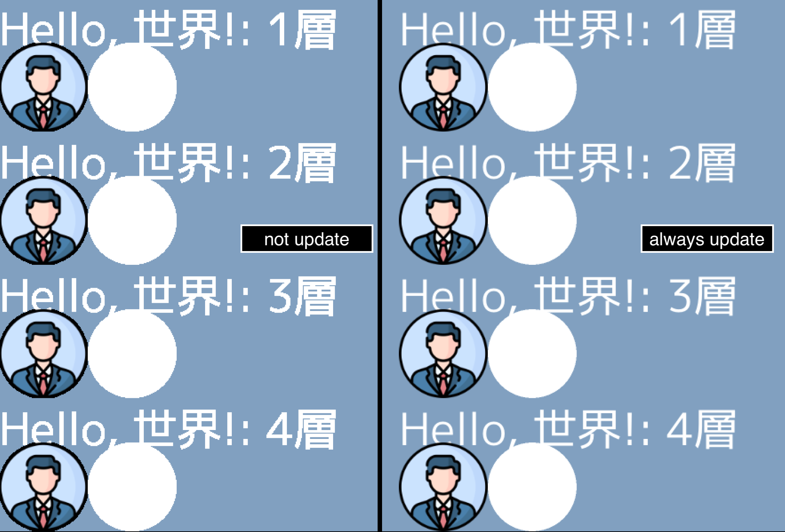
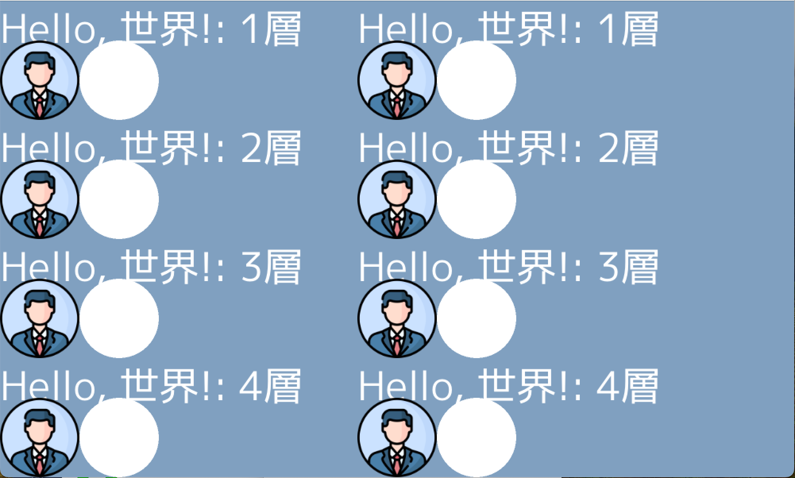

# Degradation Occurs Case
If an *ebiten.Image that is not updated by Game.Update() is drawn with Game.Draw(), the image quality degrades (for text, external images (ebiten.FilterLinear), and vector graphics).   
If *ebiten.Image is continuously updated with Game.Update(), the image quality does not degrade, but the load increases.   
(There was no degradation when layering multiple drawings.)

# Improved Case
By modifying the code to draw the *ebiten.Image that is updated by Game.Update() only once in the constructor or similar, instead of using Game.Draw(), the degradation is resolved.
