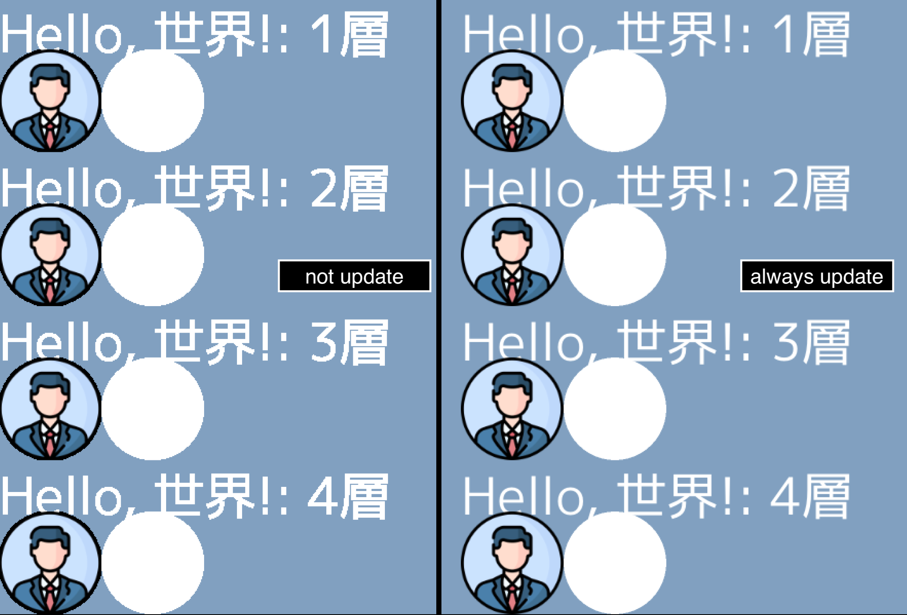

# Result
If the target *ebiten.Image for rendering is not always updated in Game.Update(), the image quality degrades.   
Text, external images (ebiten.FilterLinear), and vector graphics all degrade in quality.   
(There was no degradation due to layering multiple drawings.)
